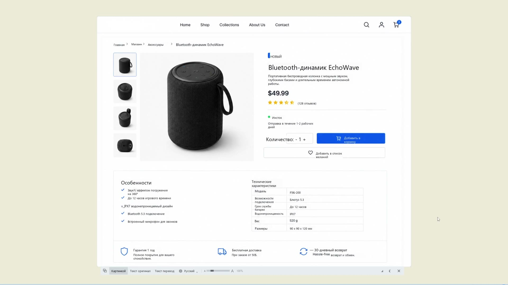

# Экранный переводчик

Работает как Google Translate на телефоне, только на экране компьютера:
нажали горячую клавишу → выделили мышкой область → текст распознаётся и **перевод
рисуется прямо поверх исходного текста**.



**[Скачать для Windows](https://github.com/Rabbicoin/screen-translator/releases/latest)** · [Описание и видео](https://sevdev.ru/apps/screen-translator) · бесплатно, без рекламы и регистрации

Распознавание работает локально через Tesseract — снимки экрана никуда не уходят.
В сеть отправляется только распознанный текст — в сервис перевода.

## In English

**Screen Translator** draws the translation directly over the text on your screen
and keeps the original layout: tables stay tables, button labels stay on buttons.
You can use the result, not just read it — you still see what to click.

Press `Ctrl+Alt+Z` and drag a selection; the translated text appears in place.
`Ctrl+Alt+X` translates the clipboard — plain text or a copied image.

- Windows 10 or 11, 64-bit. Nothing else to install: Python, Tesseract and
  22 recognition languages are bundled.
- Text recognition runs **locally**. Only the recognised text leaves your
  machine, and only to the translation service.
- Free, no ads, no account. A DeepL or Google Cloud key is optional and
  removes the rate limits of the public endpoints.
- The interface follows the language you translate into; English and Russian
  are built in, the rest are translated once and cached.

**[Download for Windows](https://github.com/Rabbicoin/screen-translator/releases/latest)**
· [Website with a video](https://sevdev.ru/en/apps/screen-translator)

The rest of this document is in Russian — it is the full manual, from the
config file to how the overlay is rendered.

## Установка

Ничего доустанавливать не нужно: Python, Tesseract и языки распознавания уже
внутри. Нужна Windows 10 или 11, 64 бита.

1. **Распаковать архив целиком** — в «Документы», на рабочий стол, куда удобно.
   Прямо из архива программа не запустится: рядом с `Переводчик.exe` должны
   лежать папки `_internal` и `tesseract`.
2. Запустить **`Переводчик.exe`**.
3. Windows покажет синее окно «Windows защитила ваш компьютер» — так она
   встречает любую программу без платной подписи разработчика:
   **Подробнее → Выполнить в любом случае**. Спрашивает один раз.

Окон программа не открывает, она уходит в трей — синяя иконка «Я» возле часов,
иногда спрятана под стрелкой «^».

**Держите папку по латинскому пути.** `C:\Programs\ScreenTranslator` — хорошо,
`C:\Users\Вася\Мои программы` — плохо: Tesseract не открывает пути с русскими
буквами. Программа такой случай переживёт — подставит Tesseract-у короткое
(8.3) имя папки, оно всегда латиницей. А вот если короткие имена в системе
отключены, ей придётся скопировать языки в `C:\Users\Public\ScreenTranslator`:
лишние 80 МБ и заметная пауза на первом запуске.

Первый запуск создаёт рядом `config.json`. Если папка защищена от записи —
например, программу положили в `Program Files` — настройки уедут в
`%APPDATA%\ScreenTranslator`.

Удаляется программа удалением папки: в системе она ничего не оставляет, кроме
галочки автозапуска, если её включали.

### Проверка, что всё сошлось

Двойной клик по **`Проверка.bat`** — программа пройдёт всю цепочку и напишет
отчёт: нашла ли Tesseract, сколько языков видит, читается ли текст с картинки,
отвечает ли переводчик. Снимок этого окна отвечает на «у меня не работает»
лучше любых расспросов.

## Запуск

Программа висит в трее (синяя иконка «Я») и ждёт горячей клавиши.

| Клавиши | Что делает |
|---|---|
| `Ctrl` + `Alt` + `Z` | выделить область экрана и перевести |
| `Ctrl` + `Alt` + `X` | перевести буфер обмена: текст или скопированную картинку (скриншот, файл картинки) |
| `Esc` | закрыть выделение или окно с переводом |

Перевод автоматически копируется в буфер обмена.

В окне результата снизу: **⧉** — копировать показанный текст (при наведении
всплывает подсказка, что именно скопируется), **Картинкой**, **Текст оригинал**,
**Текст перевод**, **выбор языка перевода**, **язык на экране**, **ползунок крупности**, уголок **◢**
для размера окна и **✕**.
Текущий режим подсвечен, кнопки оригинала и картинки появляются, только когда
им есть что показать.

**Окно таскается мышью за любое свободное место** — за картинку, за поля вокруг
содержимого и за полоску с кнопками внизу. В текстовых режимах — за пустое
место ниже последней строки и правее коротких строк. Сам текст остаётся
выделяемым: левая кнопка на нём выделяет, а не двигает окно.

Левый клик по иконке в трее — то же, что горячая клавиша.

**Язык на экране** — кнопка рядом с языком перевода: «авто», «ENG», «RUS»,
«ENG+RUS» и всё остальное, что установлено. Это то, **чем читать текст**, а не
на что переводить. Выбор ходовой: если на экране заведомо один язык — английская
игра, английский интерфейс, китайская инструкция, — назвать его прямо вдвое
быстрее, чем «авто». Замерено: игровой диалог 0,94 → 0,44 с, карточка товара
0,76 → 0,33 с, счёт на 21 строку 3,64 → 1,55 с. Экономятся отдельный проход
определения письменности и второй проход узким набором.

Цена такого выбора — текст на других языках перестаёт читаться: на счёте с
латинскими артикулами режим «только русский» теряет `Nissan`, `TEANA`, `GATES`
целиком. На смешанном тексте оставляйте «авто».

Смена языка на экране пересчитывает **тот же снимок** заново — переснимать
ничего не нужно, распознавание повторяется с новым набором.

**Скопировать кусок текста.** В режимах «Текст оригинал» и «Текст перевод»
текст можно выделить мышью и скопировать: `Ctrl+C`, `Ctrl+A` — выделить всё,
правая кнопка — меню с теми же двумя пунктами. Кнопка **⧉** рядом копирует всё
целиком, а не выделенное. Копирование работает **при любой раскладке**: Tk
узнаёт клавишу по названию буквы, и при русской раскладке привычное `Ctrl+C`
до программы просто не доходило — теперь клавиша определяется по коду.

**Светлое и тёмное оформление** переключается **прямо в окне** — значок солнца или
месяца справа от ползунка. Показывается не текущее состояние, а то, что получится
по нажатию: в тёмном окне солнце, в светлом месяц. Полный выбор, включая «как в
системе», — в трее → **Оформление**. По умолчанию «Как в
Windows»: системная настройка спрашивается при каждой отрисовке окна, поэтому
вечерний переход системы в тёмную тему подхватывается сам, без перезапуска —
следующее окно перевода откроется уже тёмным. Окно выделения области остаётся
тёмным при любом оформлении: оно затемняет снимок экрана, и светлая вуаль там
бессмысленна.

### Строка внизу окна: контакты и объявления

Под кнопками окна результата показывается **одна строка от автора программы**.
Строк на самом деле две, и они сменяют друг друга.

**Постоянная подпись — контакты.** Живёт в настройках, показывается всегда и не
зависит ни от сайта, ни от интернета:

```json
"footer_text": "Вопросы и пожелания: [Telegram @rabbiecho](https://t.me/rabbiecho) · [sevdev.ru](https://sevdev.ru)"
```

Держать контакты только на сайте нельзя: человек с готовым архивом должен
видеть, куда писать, даже если сайт лежит или ещё не поднят.

**Адреса пишутся прямо в тексте** в виде `[что видно](куда ведёт)`. У каждой
ссылки свой адрес: щелчок по «Telegram» открывает телеграм, щелчок по «sevdev.ru» — сайт.
Раньше ссылка была одна на всю строку, и любое слово вело в одно и то же место.

`footer_url` остался запасным вариантом: он срабатывает, если в тексте скобок нет —
тогда вся строка ведёт туда, как раньше. Очистить `footer_text` — строки не будет вовсе.

Та же разметка работает и в объявлении с сайта — см. `promo.example.json`.

**Временное объявление — новости.** Пока оно есть, показывается вместо подписи:
о новой версии, о платной версии, о других программах — о чём угодно. Это
единственный канал до людей, которым архив уже отдан: текст меняется на сайте,
у всех обновляется само, пересобирать и рассылать ничего не нужно.

**Текст задаётся не в программе, а файлом на сайте.** Адрес прописан в
настройках по умолчанию:

```
https://sevdev.ru/screen-translator/promo.json
```

На сайте (Astro) это `public/screen-translator/promo.json` — после деплоя
отдаётся по этому адресу как есть. Отдельный файл на программу, а не один общий:
переводчик у нас первый из многих, и объявления у них будут разные. Образец
лежит в `promo.example.json`:

```json
{
  "text": "Экранный переводчик обновился. Другие программы — на sevdev.ru →",
  "url": "https://sevdev.ru",
  "until": "2026-12-31"
}
```

- `text` — сама строка, до 140 символов: длиннее не влезет в панель и читать её
  всё равно не станут;
- `url` необязателен. Есть — строка становится ссылкой и открывается в браузере.
  Принимаются только `http` и `https`: открывать по щелчку локальные пути
  программа не будет, даже если такой адрес пришёл с сервера;
- `until` — последний день показа, после него строка пропадает сама.

**Видно её в окне перевода, а не при запуске.** Программа стартует молча, в
трей; объявление человек прочитает, когда что-нибудь переведёт.

Файл спрашивается раз в сутки (`promo_hours`) в отдельном потоке, ответ
запоминается в `promo_cache.json`. Сайт лежит, файла ещё нет, домен не поднят —
показывается вчерашнее, а на первом запуске просто ничего: ошибка тихо уходит в
отладочный лог и работе не мешает. Чтобы убрать полосу совсем, очистите
`promo_url` в `config.json`.

Размер окна и крупность содержимого — **две независимые ручки**:

| Ручка | Что меняет |
|---|---|
| Уголок **◢** справа снизу | размер окна, тянуть мышью как за край обычного окна |
| **Ползунок** `A —— A` | крупность: кегль текста или масштаб перевода на картинке |
| **Ctrl + колесо** | то же, что ползунок, шагом 10% |

Одна на другую не влияют: можно сделать шрифт крупнее, не раздувая окно, и
наоборот. Колесо без Ctrl листает содержимое.

Полосы прокрутки появляются сами, когда содержимое перестало помещаться, —
одинаково в обоих режимах, и пропадают, когда снова влезает. Место под полосу
вычитается из содержимого, а не прибавляется к окну, поэтому её появление
размер окна не дёргает.

Пределы крупности — от 50% до 300%, текущее значение показано процентами
рядом с ползунком. Переключение «Картинкой» ↔ «Текст оригинал» ↔ «Текст перевод»
габариты окна не меняет: набор кнопок в панели один и тот же.

Картинка не растягивается, а **перерисовывается в новом разрешении**, поэтому
текст на ней остаётся чётким на любой крупности. Заново переводить при этом не
нужно: перевод уже готов, сеть не дёргается. Пока ведёте ползунок, показывается
быстрый растянутый предпросмотр, а чёткая перерисовка делается один раз — когда
отпустите.

Каждое новое окно открывается в 1× (как в оригинале); если хочется другого
стартового значения — это `overlay_zoom` в `config.json`.

Окно запоминает, куда его перетащили, и остаётся на своём мониторе: при
увеличении оно растёт вправо и вниз, а у края экрана поджимается обратно,
но на соседний монитор не перескакивает. Максимальный размер считается по
тому монитору, где окно находится, — у разных экранов разное разрешение.

## Автозапуск при включении компьютера

По умолчанию выключен. Включается галочкой в меню трея — **«Запускать при
включении компьютера»**; после этого программа стартует при входе в Windows,
без окна консоли, сразу в трей.

Технически это запись `ScreenTranslator` в ветке реестра текущего пользователя
`HKCU\Software\Microsoft\Windows\CurrentVersion\Run` — права администратора не нужны.
Отключить можно и мимо программы: Диспетчер задач → вкладка **Автозагрузка**.

Вторая копия не запустится: если программа уже работает, новый запуск сразу
закроется с сообщением — иначе в трее висели бы две иконки, а горячие клавиши
достались бы только первой.

## Настройки — `config.json`

Файл создаётся при первом запуске, лежит рядом с программой (в трее есть пункт
«Открыть настройки»). После правки — перезапустить программу. Если папка
программы защищена от записи, файл — а с ним словарь и кэши — уезжает в
`%APPDATA%\ScreenTranslator`.

| Параметр | Значение |
|---|---|
| `hotkey_capture` | горячая клавиша выделения, например `<ctrl>+<shift>+q` |
| `hotkey_clipboard` | горячая клавиша перевода буфера |
| `target_lang` | язык перевода: `ru`, `en`, `de`, …. Выбирается и мышью: трей → **Переводить на** |
| `translator` | `free` — публичные точки Google; `deepl` или `google_api` — официальный сервис по своему ключу. Выбирается и мышью: трей → **Сервис перевода** |
| `api_key` | ключ платного сервиса; вводится через трей → **Сервис перевода → Ввести ключ…** |
| `ocr_langs` | `auto` — определять письменность самой; либо явно через `+`: `eng+rus`. Выбирается и мышью: правый клик по иконке в трее → **Язык на экране** |
| `ocr_langs_fallback` | основной набор языков: с него начинается распознавание, им же читаем, когда письменность не опознана |
| `theme` | `auto` — как в Windows, либо `light`, либо `dark`. Выбирается и мышью: трей → **Оформление** |
| `footer_text` | постоянная строка внизу окна перевода: контакты автора; пусто — строки нет |
| `footer_url` | куда ведёт щелчок по ней; только `http` и `https` |
| `promo_url` | адрес файла с объявлением автора; пусто — программа никуда не ходит и полосу не рисует |
| `promo_hours` | как часто перечитывать объявление, по умолчанию раз в сутки |
| `display_mode` | `overlay` — перевод поверх картинки, `panel` — просто текстом |
| `ocr_scale` | увеличение перед распознаванием (2.0 — норм, 3.0 — для мелкого шрифта) |
| `tesseract_psm` | `3` — авторазметка страницы (колонки, карточки), `6` — сплошной блок текста |
| `auto_copy` | копировать перевод в буфер автоматически |
| `font_size` | размер шрифта в текстовом режиме |
| `overlay_font_scale` | кегль перевода относительно блока: `1.2` — крупнее на 20% |
| `overlay_zoom` | увеличение всей картинки результата: `1.5` — в полтора раза |
| `overlay_min_font` | ниже этого кегля не ужимаем, лишнее режем многоточием |
| `overlay_line_spacing` | межстрочный интервал, по умолчанию `1.25` |
| `overlay_uniform_font` | `true` — один кегль на весь текст, `false` — каждый блок сам по себе |
| `tesseract_path` | путь к `tesseract.exe`, если он не нашёлся сам |

Настройки, кроме горячих клавиш и автозапуска, подхватываются **на лету** —
достаточно сохранить `config.json`, перезапускать программу не нужно.

### Про размер шрифта перевода

Кегль подбирается автоматически: перевод должен поместиться в ту же рамку, где
стоял оригинал. Русский текст длиннее английского на 15–20%, поэтому шрифт обычно
получается чуть мельче исходного — это не баг, а нехватка места.

Отсюда важное: **`overlay_font_scale` вверх работает не всегда.** Уменьшает он
надёжно, а увеличивает только там, где под блоком есть запас; если текст и так
впритык, поднимать эту настройку бессмысленно.

Чтобы перевод стал крупнее гарантированно:

- **Ползунок** в самом окне результата — самый быстрый способ, ничего
  настраивать не надо.
- **`overlay_zoom`** — то же увеличение, но как стартовое значение для каждого
  нового окна. Работает всегда и при любой вёрстке, текст остаётся чётким
  (рисуется сразу в новом разрешении). По умолчанию `1.0` — как в оригинале.
- **`overlay_line_spacing`** — опустите до `1.1`: строки станут плотнее, освободится
  место по высоте, и автоподбор сможет взять кегль покрупнее.
- Выделяйте область **с запасом снизу** — нижним блокам обычно и не хватает места.

Быстро подкрутить кегль можно из трея: пункты **«Шрифт перевода крупнее / мельче»**
меняют `overlay_font_scale` шагом 0.1 и сразу пишут новое значение в `config.json`.

## Знакомые слова — `ocr_words.txt`

Заглавные латинские и русские буквы — это одни и те же значки: `H` и `Н`, `T` и
`Т`, `A` и `А`, `C` и `С`, `O` и `О`, `B` и `В`. Распознавание выбирает алфавит
по словарю языка, а на слове, которого в словаре нет, выбирать ему не по чему —
и «Всего» превращается в «Bcero», «без НДС» в «6e3 HOC», «АКПП» в «AKNN».

Файл `ocr_words.txt` — список слов, которые программа знает «в лицо». Слово из
списка узнаётся **по форме значков**, а не по буквам, поэтому подмена алфавита
ему не страшна. Одно слово в строке, строки с решёткой — пояснения. Файл
перечитывается на лету: сохранили — и следующий снимок уже с новым словом.

Замена срабатывает, только если прочитанное слово написано **не той
письменностью, что преобладает на снимке**. Иначе английское `bud` на
английской же странице превращалось бы в русское «Вид»: по форме значков они
неразличимы, и единственное, что их разводит, — язык остального текста.

Слова короче двух букв не берутся: под такую форму подходит слишком многое.

Чего этот список не чинит:

- **Слово, внутри которого оба алфавита** — «HITACHI_УЗКИЙ». Распознавание
  выбирает письменность на слово целиком, поэтому правильно его не прочитает
  ни один набор языков: с `eng` верна латинская половина и испорчена русская,
  с `rus` наоборот. Форма такого слова ни с чем не совпадёт.
- **Потерянные буквы.** «HITACHI» прочиталось как «НТАСН» — двух букв просто
  нет, и по форме это уже другое слово.

## Глоссарий — `glossary.json`

Машинный перевод стабильно промахивается по отраслевым терминам: `contract holder`
он переводит как «держатель контракта», хотя в ВЭД это «контрактодержатель».
Файл `glossary.json` лежит рядом с программой и правит такие места в готовом переводе:

```json
{
  "держатель контракта": "контрактодержатель",
  "держателя контракта": "контрактодержателя"
}
```

Слева — как перевёл движок, справа — как надо. Регистр не важен: правило
`"держатель контракта"` сработает и на «Держатель контракта», причём заглавная
буква в начале строки сохранится. Падежные формы приходится перечислять отдельно.
Если фразы пересекаются, сначала применяется более длинная.

Файл перечитывается на лету — перезапускать программу после правки не нужно.
Пустой файл или `{}` просто отключают глоссарий.

## Что внутри комплекта

| Файл или папка | Зачем |
|---|---|
| `Переводчик.exe` | сама программа |
| `Переводчик (отладка).exe` | она же, но с окном консоли и подробным логом |
| `Проверка.bat` | самопроверка: Tesseract, языки, распознавание, перевод |
| `_internal\` | Python и библиотеки, трогать не нужно |
| `tesseract\` | распознавание текста (Tesseract 5, лицензия Apache 2.0) |
| `tesseract\tessdata\` | языки распознавания |
| `config.json` | настройки, создаются при первом запуске |
| `glossary.json` | свой словарь замен |
| `ui_*.json` | переводы интерфейса, докачиваются сами |

Языки распознавания в комплекте (22): английский, русский, украинский,
казахский, болгарский, сербский, немецкий, французский, испанский, итальянский,
португальский, голландский, польский, турецкий, арабский, фарси, иврит,
китайский (упрощённый и традиционный), японский, корейский.

Всего около 190 МБ: 80 МБ языки, 70 МБ Tesseract, остальное Python с
библиотеками. Интернет нужен для перевода; кроме того, раз в сутки программа
заглядывает на `sevdev.ru` — узнать, нет ли новостей от автора. Распознавание
работает без сети.

## Языки

**Язык перевода** выбирается **прямо в окне результата** — кнопка с названием
языка рядом с кнопками режимов. Список открывается вверх, каждый язык назван на
себе самом («Deutsch», «日本語»), так что читается при любом языке интерфейса.
Выбрали другой — тот же снимок пересчитывается на новый язык **без повторного
распознавания**: блоки уже есть, тратится только запрос к переводчику. Пока
считает, на месте кнопки написано «Перевожу…».

Тот же выбор есть в трее → **Переводить на**. В списке два десятка языков, на
которые переводят чаще всего; если нужен какой-то другой, впишите его код в
`target_lang` в `config.json` — программа возьмёт любой, который знает сервис, а
в меню он появится отдельным пунктом, чтобы выбор не пропал из виду.

**Интерфейс говорит на том же языке.** Выбрали «переводить на немецкий» — кнопки,
подсказки и меню в трее тоже станут немецкими. Русские и английские надписи
написаны в программе, остальные она один раз переводит тем же сервисом и кладёт
рядом с настройками в `ui_<язык>.json`; дальше берёт оттуда мгновенно. Пока
перевод надписей не пришёл, интерфейс говорит по-английски — программа из-за
этого не ждёт и работает как обычно.

**Исходный язык** перевод определяет сам — указывать ничего не нужно, работает
с любым языком, который знает Google Translate.

По умолчанию он идёт через публичные точки Google — те же, куда ходит переводчик
в браузере. Они бесплатны, но общие на всех: после десятка снимков подряд оттуда
прилетает «слишком много запросов», и программа переключается на запасные, где
перевод грубее. Если это мешает, подключите **свой ключ**: трей → **Сервис
перевода** → DeepL или Google Cloud, затем **Ввести ключ…**. Лимит снимается, и
качество на русском у DeepL заметно лучше. Порядок цен: Google Cloud ~$20 за
миллион символов, DeepL — от €5.49 в месяц плюс €20 за миллион, у DeepL есть и
бесплатный ключ на 500 тысяч символов в месяц (оканчивается на `:fx`).

Бесплатные точки при этом никуда не деваются: если платный сервис не ответил или
на ключе кончился объём, перевод пойдёт через них — программа не останется без
перевода из-за чужого сбоя. Ключ хранится в `config.json` открытым текстом, как и
остальные настройки.

**Если известно, что на экране,** назовите язык прямо — правым кликом по иконке
в трее, пункт **Язык на экране**. Это заметно быстрее автоопределения: на снимке
величиной с половину экрана разбор занимает 0.6 с против 1.2 с. Экономия
складывается из двух частей — не нужен отдельный проход на определение
письменности (~0.2 с) и в наборе остаётся один язык вместо двух (ещё ~0.4 с:
каждая языковая модель считается отдельно). Выбор запоминается в `config.json`,
перезапуск не нужен. Автоопределение остаётся первым пунктом того же меню — оно
удобнее, когда языки заранее не известны или меняются.

**Распознавание** — другое дело: Tesseract ищет только те языки, что ему заданы.
При `"ocr_langs": "auto"` программа сначала отдельным быстрым проходом определяет
письменность (латиница, кириллица, иероглифы, арабица и так далее). Распознавать
сразу всеми установленными языками и медленно, и менее точно, поэтому набор
сужается — и сужается сильно: первой попыткой идут языки из `ocr_langs_fallback`
(по умолчанию `eng+rus`) плюс язык перевода. Именно они обычно и видны на экране,
а полный список языков письменности — для латиницы это девять моделей и втрое
больше времени — остаётся второй попыткой, на случай если узкий набор не
справится. Письменности, которую `ocr_langs_fallback` не покрывает (иероглифы,
арабица), это не касается: там сразу полный список.

На коротком тексте определение письменности врёт — например, уверенно называет
латиницу кириллицей, а китайскую строку то Han, то Japanese. Поэтому:

- есть порог доверия: при низкой уверенности берётся `ocr_langs_fallback`
  (по умолчанию `eng+rus`), то есть хуже прежнего не станет;
- иероглифы и слоговые азбуки читаются общим набором моделей — проверено, что
  японский и корейский от этого не страдают, а путаница снимается;
- если узкий набор много слов отбросил, идут следующие попытки — полным списком
  письменности и всеми установленными языками; берётся результат, где прочитано
  больше.

Последнее важно для картинок, **где языки смешаны**: одну письменность на всю
картинку там выбрать нельзя в принципе. Такой перебор медленнее (секунды вместо
доли секунды), но включается только когда узкий набор явно не справился.

Перевод смешанной картинки тоже не так прост: все куски уходят одним запросом,
а сервис определяет **один** исходный язык на весь пакет и куски на прочих
языках возвращает нетронутыми. Поэтому после пакета каждый кусок проверяется, и
непереведённые до-переводятся по одному — тогда у каждого своё автоопределение.

Прочитать можно только установленный язык — список видно в логе отладки.

## Добавить другие языки распознавания

Скачать нужный файл со страницы
`https://github.com/tesseract-ocr/tessdata_fast` (например `deu.traineddata` —
немецкий, `jpn.traineddata` — японский, `chi_sim.traineddata` — китайский).

Класть **в папку `tesseract\tessdata` рядом с программой** — там уже лежат
остальные, права администратора не нужны.

Есть и второе место, `%USERPROFILE%\ScreenTranslator\tessdata`: программа смотрит
туда в первую очередь. Оно удобно, когда программу переставляют, но перекрывает
комплектную папку целиком — заведя его, положите туда сразу все нужные языки,
включая `eng` и `osd`.

Два ограничения на место:

- **Без кириллицы в пути.** Tesseract на Windows такие пути не открывает — в логе
  отладки будет `TESSDATA_PREFIX ... does not exist`. Программа сначала пробует
  короткое (8.3) имя папки, оно всегда латиницей; если короткие имена в системе
  отключены, копирует языки в `C:\Users\Public\ScreenTranslator\tessdata` и
  читает оттуда. Работает, но стоит 80 МБ и паузы на первом запуске.
- **Не внутри `AppData`.** У приложений из Microsoft Store запись туда
  перенаправляется в их собственный контейнер: папка вроде бы создаётся, но
  Проводник её не видит и программа, запущенная обычным двойным кликом, тоже.
  Отсюда и выбор корня профиля.

Если своя папка задействована, языки читаются **только из неё**, так что `eng`,
`rus` и `osd` должны лежать там же.

При `"ocr_langs": "auto"` дописывать язык в настройки не нужно — он подхватится
сам, как только понадобится по письменности.

Чем меньше языков установлено, тем точнее и быстрее распознавание — держите
только те, что реально нужны.

## Если что-то не работает

Начните с **`Проверка.bat`**: она проходит всю цепочку и говорит, какой кусок не
поднялся. Нужны подробности работы — **`Переводчик (отладка).exe`**: та же
программа, но с консолью, куда пишется каждый шаг.

- **Не реагирует на `Ctrl+Alt+Z`.** Сочетание может быть занято другой программой
  (в логе будет `сочетание занято другой программой`) — поменяйте `hotkey_capture`
  в `config.json`. Проверить, что программа вообще жива, можно кликом по иконке
  в трее: она открывает то же выделение области.
- **Текст не распознан.** Выделяйте область чуть с запасом, но без лишнего фона.
  Для мелкого шрифта поднимите `ocr_scale` до `3.0`.
- **Перевод обрывается на многоточии.** Значит, он не поместился в исходную рамку
  даже минимальным шрифтом — обрезать честнее, чем наползать на соседний текст.
  Полный перевод при этом лежит в буфере обмена и открывается кнопкой
  **Текст перевод**.
  Чаще всего помогает выделить область с запасом снизу.
- **Ошибка перевода.** Перевод идёт через публичную точку Google Translate. Если
  она молчит или отвечает «429, слишком много запросов» — а такое бывает после
  десятка снимков подряд, — программа сама переходит на вторую точку Google (ту,
  куда ходит переводчик в Chrome), а если и её нет, на запасной сервис MyMemory.
  Отказавшую точку минуту не трогаем, иначе каждый кусок снова ждёт отказа.
  Перевод у запасных чуть грубее, зато ответ за доли секунды вместо нескольких
  секунд. Если молчат все трое — проблема с сетью или VPN.

## Запуск из исходников

Нужны Python 3.10 или новее и Tesseract OCR — это отдельная программа, а не
библиотека Python:

1. **Python** — <https://www.python.org/downloads/windows/>, при установке
   галочка «Add python.exe to PATH».
2. **Tesseract** — <https://github.com/UB-Mannheim/tesseract/wiki>. Ставится в
   `C:\Program Files\Tesseract-OCR`, там программа его и найдёт.
3. **Библиотеки** — в папке программы: `pip install -r requirements.txt`
4. **Языки распознавания** — файлы `*.traineddata` из
   <https://github.com/tesseract-ocr/tessdata_fast> в
   `%USERPROFILE%\ScreenTranslator\tessdata`. Обязательные — `eng` и `osd`.

Запуск: **`Переводчик.bat`** (без консоли) или **`Переводчик (отладка).bat`**
(с логом). Проверить, что всё сошлось: `python screen_translator.py --selftest`.

## Сборка .exe

**`Сборка.bat`**, он же `python build.py`. Нужен PyInstaller:
`pip install pyinstaller`.

На выходе — папка `dist\ScreenTranslator\` и архив
`dist\ScreenTranslator-<дата>.zip`, который и отдают. Сборка кладёт в комплект
Tesseract из `C:\Program Files\Tesseract-OCR` и языки из
`%USERPROFILE%\ScreenTranslator\tessdata`, то есть человек получает ровно тот
набор, что стоит у автора.

Ключи:

- `--no-zip` — не тратить время на архив, когда пересобираешь «на посмотреть»;
- `--keep-langs eng,rus,deu` — взять только эти языки (`osd` добавляется всегда),
  чтобы архив похудел: полный набор весит 80 МБ из 190.

Имя папки `ScreenTranslator` латиницей не для красоты: внутри неё лежат языки
распознавания, а Tesseract не открывает пути с кириллицей. На имена самих `.exe`
это не распространяется, они русские.

После сборки скрипт сам запускает `tesseract.exe` из комплекта и смотрит, что
тот отвечает и видит языки: недоложенная библиотека всплывёт здесь, а не у
человека, которому отдали архив.

Отдельная забота — доверие системы. Свежесобранный `.exe` без подписи вызывает
у Windows SmartScreen и антивирусов подозрение; человека об этом надо
предупредить (в `Как пользоваться.txt` предупреждение есть). Лечится
сертификатом разработчика, он платный.

## Как устроено

`screen_translator.py`, один файл:

1. `RegisterHotKey` (WinAPI) ловит горячую клавишу — работает при любой раскладке.
2. Снимок всех мониторов (`ImageGrab`), поверх него окно выделения.
3. Вырезанный кусок увеличивается, обесцвечивается, прогоняется через Tesseract.
   Слова собираются в строки, строки режутся по вертикальным «рвам» (пустым
   полосам между колонками и карточками) и склеиваются в абзацы по вертикальным
   зазорам. Ров ищется **в полосе вокруг строки**, а не на всю высоту снимка:
   под сеткой карточек почти всегда идёт абзац во всю ширину, он перекрывает
   разом все рвы — и надписи соседних карточек склеивались в одну строку.
   Полоса берётся с парой строк выше и ниже, а сам ров должен быть заметно шире
   межсловного пробела: иначе рвом становится любой пробел в одинокой строке
   или отступ от буллита, и строка режется на куски.
   Порядок слов справа налево включается по самим символам строки, а не по
   списку языков. Перевод на иврит или арабский на картинке разворачивается в
   зрительный порядок и прижимается к правому краю блока: ни Pillow, ни Tk сами
   этого не делают, буквы кладутся слева направо, и фраза читалась наоборот.
   Куски на латинице и числа («\.99», «16 x 12 x 5») внутри такой строки
   остаются как есть — они читаются слева направо. Строка, начинающаяся с маркера списка («23.», «7)», «•»,
   «— »), всегда открывает новый абзац: иначе соседние пункты слипаются в одно
   предложение и портятся и вёрстка, и перевод. Кружок буллита Tesseract читает
   как что угодно — «e», «®», «»», «*», — поэтому такое начало строки сначала
   приводится к нормальному «•». Но чаще кружка не видно вовсе, и тогда пункт
   начинается ровно с той же позиции, что и перенос внутри пункта. Границу
   абзаца в этом случае дают два признака, оба считаются от самого текста, а не
   заданы числом: **строка дотянулась до правого края** (перенос случается
   тогда и только тогда, когда первое слово следующей строки в остаток не
   влезло — влезало бы, значит строку оборвали намеренно) и **шаг строк** —
   отбивка между пунктами больше обычного междустрочного в этом же снимке.
   Выравнивание переноса принимается любое: и под текстом пункта (списки с
   буллитом), и под самим маркером (нумерованный текст в чате). Строки таблицы («Бренд» и рядом «YATINEY»)
   узнаются по соседу на той же высоте через широкий провал, где левая ячейка
   занимает лишь малую часть своей колонки; такие ячейки не склеиваются со
   строками сверху и снизу, а в тексте пара «подпись — значение» ставится в одну
   строку. В тексте, набранном в две колонки, строки колонку заполняют, поэтому
   он под это правило не попадает и разбирается как обычные абзацы. Мусор вроде
   рамок, иконок и ASCII-графики («аааааа», «| | |») отсеивается — его не
   переводят и не закрашивают; исключение — числовая ячейка таблицы («4»,
   `36" x 39" x 87"`): переводить там нечего, но без неё подпись выглядит
   оборванной. **Значок рядом с надписью** («щит» у гарантии, галочка в списке)
   попадает в ту же строку, и Tesseract читает его как одну-две случайные буквы —
   в переводе выходило «ГБ Бесплатная доставка», а сам значок ещё и закрашивался
   заливкой блока. Такое начало строки отбрасывается; от буллита списка значок
   отличают два признака, оба меряются по самой строке: он заметно выше букв и
   стоит от текста дальше, чем слова стоят друг от друга.
4. Абзацы переводятся одним запросом к Google Translate (готовые переводы
   помнятся, поэтому повторный снимок того же места мгновенный), затем к результату
   применяется `glossary.json`. Куски без единой буквы — цены, размеры, «16 x 12 x 5» —
   не переводятся вовсе: переводить там нечего, а на карточке товара таких кусков
   бывают два десятка, и раньше каждый из них переспрашивался отдельным запросом
   (это и были лишние пять секунд ожидания). На картинке они остаются нетронутыми,
   то есть выглядят точно как в оригинале.
5. Исходный текст закрашивается, перевод пишется поверх (`render_overlay`) в
   четыре прохода: посчитать место под каждый блок → выбрать кегль по классам
   текста → разложить строки → закрасить все блоки и только потом написать весь
   текст. Раздельные проходы заливки и текста нужны, чтобы заливка нижнего блока
   не затирала хвост верхнего.

   **Кегль оригинала** считается с поправкой на выносные буквы: Tesseract обводит
   сами буквы, а не кегельную площадку, поэтому строка без выносных («Черная
   Тень») ниже строки с ними при том же шрифте. Сверху оценка ограничена шириной
   строки (средняя буква — примерно полкегля): на коротких надписях Tesseract
   нет-нет да и отдаёт рамку заметно выше самих букв.

   **Классы текста.** Оценка кегля всё равно пляшет на пару пунктов — на
   коротком слове без выносных («Вес», «Модель») ошибиться легко. Поэтому блоки
   разбиваются по кеглю оригинала на классы (подписи, тело, подзаголовки,
   заголовки), и внутри класса все равняются на его медиану, а не на собственную
   оценку: соседние строки таблицы перестают прыгать. Общий кегль **на весь
   снимок** был ошибкой: подпись под значком и заголовок раздела попадали в один
   расчёт, и весь перевод съезжал к размеру самого тесного блока — каждый блок
   помещался в свой родной размер, а рисовался заметно мельче оригинала.
   Внутри класса кегль берётся не по самому тесному блоку, а по нижней шестой
   части: одна тесная карточка не должна мельчить остальные, ей текст обрежется
   многоточием. Ниже 85% медианы класса не опускаемся.

   **Ширина проверяется отдельно от высоты.** Перенос спасает не всегда:
   «Водонепроницаемость» — одно слово, разорвать его негде, и по числу строк оно
   всегда «влезало», а на картинке уезжало в соседнюю колонку поверх чужого
   текста. Единственный способ вместить такое — уменьшить кегль.

   **Куда блоку можно разрастись.** Перевод длиннее оригинала, поэтому блоку
   разрешено расти вправо и вниз — но не на соседей. Соседа справа мало: у
   крайней карточки его нет вовсе, и текст вылезал за её край на пустое поле.
   Границу колонки показывают ещё два признака: блок, уже перенесённый на
   несколько строк, свою ширину исчерпал (перенос и случился потому, что правее
   места нет), а у однострочного её показывает самый длинный сосед сверху или
   снизу в той же колонке. Короткой подписи вроде «Вес» сверх того разрешена
   четверть своей ширины — иначе её перевод обрезался бы многоточием на ровном
   месте.

   **Заливка.** На ровном фоне — странице, карточке, ячейке таблицы — закрашиваем
   начисто. Смесь с размытым оригиналом (так было раньше) оставляла на белом поле
   серую тень ростом с исходную надпись: перевод короче и мельче, и «стёртое»
   место торчало прямоугольником рядом с каждой строкой. Ровный ли фон, считается
   не по доле фона — у плотно обведённой надписи её в рамке мало, — а по числу
   цветов: надпись на ровном фоне это два цвета плюс сглаживание между ними, а
   фотография и градиент так не укладываются, там на два самых частых цвета
   приходится втрое меньше. Под ними по-прежнему размытие: ровная плашка на
   фотографии выглядит заплаткой.

   Перед отрисовкой холст временно наращивается снизу: у последних блоков иначе
   нет места под перевод, который длиннее оригинала. Лишний запас срезается в конце.


## Запуск из исходников

Готовая сборка лежит в [релизах](https://github.com/Rabbicoin/screen-translator/releases) и ничего дополнительного не требует.
Запуск из кода нужен, если хочется править программу:

```
pip install -r requirements.txt
python screen_translator.py
```

Отдельно ставится [Tesseract OCR](https://github.com/UB-Mannheim/tesseract/wiki) — это не библиотека Python.
Настройки берутся из `config.json`; образец со всеми полями — `config.example.json`,
свой словарь замен — `glossary.example.json`. Оба личные файлы в репозиторий не попадают.

## Лицензия

GPL-3.0 — см. файл [LICENSE](LICENSE). Кодом можно пользоваться и изменять его,
но производные работы должны оставаться открытыми под той же лицензией.

В сборку входит [Tesseract OCR](https://github.com/tesseract-ocr/tesseract) под лицензией Apache 2.0 —
её текст лежит рядом в папке `tesseract`.

## Если хотите прислать исправление

Буду рад. Одно условие: присылая код, вы соглашаетесь, что автор проекта
вправе использовать его в том числе в версиях на других условиях. Без этого
проект навсегда теряет возможность менять лицензию — даже автор не сможет
сделать этого без согласия каждого, кто когда-либо прислал строчку.
